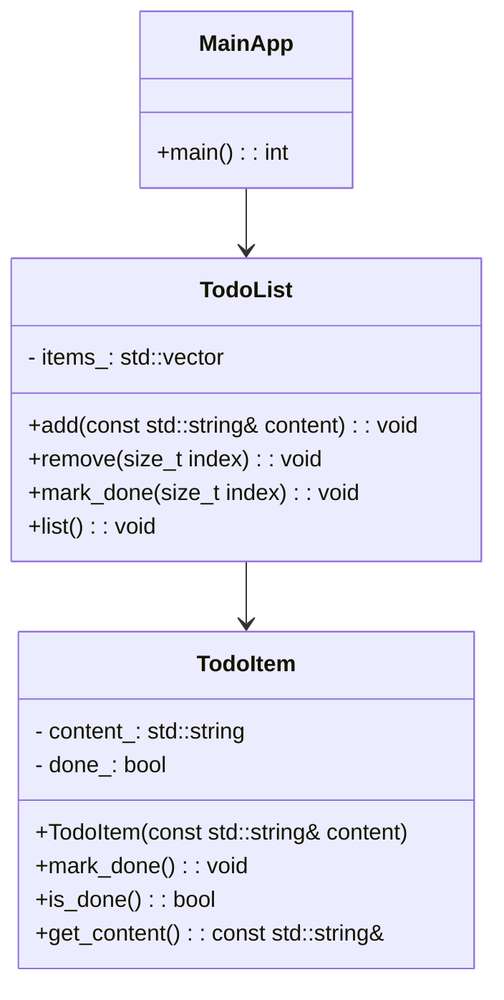

# Todo App 專案 UML 圖

---

## 圖說

* `MainApp` 代表 `main.cpp` 的程式入口，與 `TodoList` 溝通。
* `TodoList` 管理多個 `TodoItem`，提供新增、刪除、列出、標記完成的功能。
* `TodoItem` 是待辦事項的資料結構，包含內容與是否完成。

> 本 UML 圖可作為專案結構導覽圖，未來若擴充 GUI、資料儲存，可持續補充。
